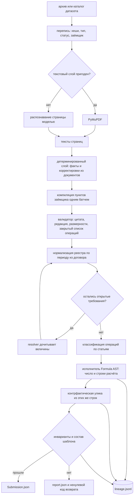

# halyk

Агент проверки ковенантов. На входе — архив с кредитными договорами,
допсоглашениями и реестром транзакций. На выходе — по каждому ковенанту каждого
заёмщика вердикт, число, которым он обоснован, и транзакция-улика.

Ключевое свойство: **арифметику и вердикт выдаёт код, а не языковая модель**. Модель
читает договор и компилирует пункт в типизированную спецификацию; дальше работает
детерминированный исполнитель, который по каждому ответу оставляет цепочку от
координат в PDF до конкретных строк реестра.

Состояние: путь замкнут целиком — от архива до проверенного ответа. Промпты по
модели ещё не отлаживались, живой прогон на приватном датасете не делался.

## Быстрый старт

```bash
uv sync --all-groups --locked
cp .env.example .env          # ключи моделей, команда и почта

uv run halyk solve --input data/dataset.zip --output Submission.json
uv run halyk validate --submission Submission.json --template agentic-bank-public/submission_template.json
```

Состав ячеек берётся из `submission_template.json` внутри датасета; свой шаблон
задаётся флагом `--template`.

Запасной путь, если не хочется чинить окружение:

```bash
docker build -t halyk-agent .
docker run --rm --env-file .env -v $PWD/data:/data halyk-agent \
    solve --input /data/dataset.zip --output /data/Submission.json
```

## Как это работает



Допсоглашения не заменяют договор целиком: версионирование идёт по пунктам, и
исполнитель получает ту редакцию пункта, которая действовала на дату измерения.

## Что остаётся после прогона

Каждый запуск пишет каталог `artifacts/runs/<run_id>/`:

| Файл | Что внутри |
|---|---|
| `run_manifest.json` | хеши входа, шаблона, промптов и схем, коммит, хеш lock-файла, версии моделей, режим запуска, хеши ответа и кэша |
| `lineage.jsonl` | по записи на ковенант: источники с координатами, IR, шаги расчёта, строки, число, вердикт, улика, инварианты |
| `metrics.json` | документы, страницы, вызовы по стадиям: попадания в кэш, токены, время, повторы, нерешённое |
| `report.json` | диагностика: что помешало ячейке, какие корректировки не дошли до реестра, какие ответы моделей отклонены |
| `submission.json` | копия ответа рядом с тем, чем он обоснован |
| `model_cache/` | ответы моделей по хешу запроса |

`lineage.jsonl` — единственный источник правды: отчёт, команда `explain` и проверка
инвариантов читают его, а не пересчитывают заново.

Прогон строгий. Незакрытое требование, спорная величина, несчитанная ячейка и
непройденный инвариант заканчиваются ненулевым кодом возврата и записью в
`report.json`, а `Submission.json` не пишется вовсе: `null` в ячейке стоит тех же
нуля баллов, что и неверное число, но выглядит как ответ. Отказ одного заёмщика
остальных не отменяет — их диагностика остаётся в отчёте.

## Разбор одного ответа

```bash
uv run halyk explain B-014 C-003
```

Печатает цепочку целиком: цитату из договора с указанием файла и страницы,
скомпилированный IR, шаги фильтрации с количеством строк, итоговое сравнение с
порогом и выбранную улику. Это же содержимое попадает в HTML-карточку решения
вместе с вырезкой страницы договора по координатам.

## Воспроизводимость

Решение должно перезапускаться и давать те же ответы. `temperature=0` этого не
гарантирует, поэтому воспроизводимость обеспечивается явно.

```
новый прогон                         живые вызовы, кэш только пишется
продолжение прогона                  --resume <run_id>, кэш того же каталога
повторение конкретного прогона       --replay artifacts/runs/<run_id>, промах — ошибка
счёт только по кэшу                  --offline, живой вызов запрещён
```

Кэш лежит в каталоге прогона, поэтому переиспользуется он через `--resume` и
`--replay`, а не сам собой. Новый прогон никогда не читает чужой кэш молча: ключ
включает хеши исходных документов, промпта и схемы ответа, а режим пишется в манифест
вместе со счётчиками `cache_hits` и `live_calls`. Сколько прогон посчитал, а сколько
воспроизвёл — видно в `metrics.json` по стадиям.

`make verify-determinism` проверяет это двумя способами: повтор из кэша обязан
совпасть байт-в-байт, а два живых прогона на открытом датасете сравниваются, и
измеренное расхождение публикуется здесь же.

Кэш боевого прогона в репозиторий не коммитится — это производные закрытого
датасета. Его хеш зафиксирован в манифесте, сам артефакт передаётся по запросу.
В репозитории лежит только `artifacts/example-run/` на открытых данных.

Подробности — [docs/adr/0006](docs/adr/0006-reproducibility-and-cache-policy.md).

## Структура

```
src/halyk/
├── models/         контракты данных, из них же генерируются JSON Schema
├── ingest/         распаковка архива, инвентаризация, классификация
├── parsing/        PyMuPDF, оценка пригодности текстового слоя, OCR
├── knowledge/      факты из документов, статьи операций, связанные стороны
├── compiler/       текст пункта → Formula AST и проверка ответа модели
├── resolution/     дочитывание величин, которых не нашёл разбор
├── execution/      исполнитель дерева, выбор улики
├── verification/   инварианты прогона
├── output/         шаблон ответа, проверка по схеме, explain
├── llm/            единственная дверь к моделям: кэш, бюджет, повторы
├── pipeline/       сквозной прогон, отчёт, метрики
└── run/            каталог прогона, манифест, аудиторский след
```

Схемы в `schemas/` не пишутся руками — они выгружаются из моделей, а CI проверяет,
что закоммиченная версия совпадает с текущей.

## Решения по архитектуре

Развилки, которые дорого менять, вынесены в [docs/adr](docs/adr/): разделение ролей
модели и кода, деньги целым числом в тиынах, версионирование по пунктам, отказ от
агентных фреймворков, правило выбора улики, политика кэша.

## Разработка

```bash
make quality   # ruff, mypy, синхронность схем с моделями
make test      # pytest
make schemas   # перегенерировать схемы после правки моделей
```
