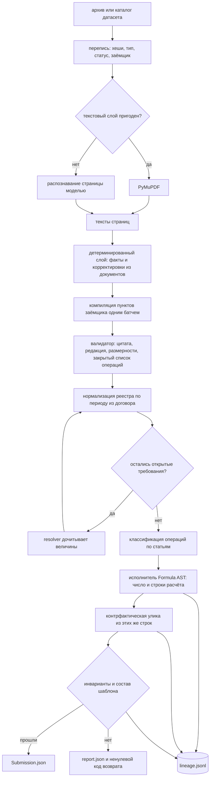

# Halyk Covenant Agent

[](https://github.com/VllSunday/halyk-covenant-agent/actions/workflows/ci.yml)

Агент проверки ковенантов. На входе — архив с кредитными договорами,
допсоглашениями и реестром транзакций. На выходе — по каждому ковенанту каждого
заёмщика вердикт, число, которым он обоснован, и транзакция-улика.

Ключевое свойство: **арифметику и вердикт выдаёт код, а не языковая модель**. Модель
читает договор и компилирует пункт в типизированную спецификацию; дальше работает
детерминированный исполнитель, который по каждому ответу оставляет цепочку от
координат в PDF до конкретных строк реестра.

Модели распределены по цене ошибки: Luna классифицирует операции, Terra читает
страницы, проверяет спорные строки, компилирует договор и дочитывает факты. Sol
подключается только когда компилятор или resolver дважды не дали пригодного либо
завершённого результата. Ошибка сети, квоты или бюджета в Sol не эскалируется.
Точная маршрутизация и её цена описаны в [ADR 0011](docs/adr/0011-tiered-model-routing.md).

Состояние: путь замкнут целиком — от архива до проверенного ответа. На публичном
наборе холодный прогон и повтор из кэша дали 36 из 36 правильных ячеек; повтор
побайтно совпал с исходным ответом. Приватные данные в репозиторий не входят.

## Быстрый старт

```bash
uv sync --all-groups --locked
cp .env.example .env          # ключи моделей, команда и почта
mkdir -p data submission
# сохраните архив организаторов как data/dataset.zip

uv run halyk solve --input data/dataset.zip --output submission/attempt-1.json
```

`HALYK_MAX_CONCURRENCY=6` параллельно разбирает независимые PDF и заёмщиков.
Порядок ответа при этом остаётся порядком шаблона, а общий лимит стоимости и
числа живых вызовов применяется ко всему прогону. При ответах API `429` уменьшите
значение до `2`; последовательный диагностический режим — `1`.

Состав ячеек берётся из `submission_template.json` внутри датасета; свой шаблон
задаётся флагом `--template`.

Полная инструкция боевого дня: [docs/battle-runbook.md](docs/battle-runbook.md).

## Запуск в Docker

Docker — второй путь запуска с тем же lock-файлом и теми же моделями:

```bash
docker build -t halyk-agent .
docker run --rm --env-file .env \
    -v "$PWD/data:/data" \
    -v "$PWD/submission:/submission" \
    -v "$PWD/artifacts:/app/artifacts" \
    halyk-agent solve --input /data/dataset.zip --output /submission/attempt-1.json
```

Либо одной командой `docker compose run --rm halyk`. Готовый файл появится в
`submission/attempt-1.json`, артефакты диагностики — в `artifacts/runs/<run_id>/`.

## Как это работает



Допсоглашения не заменяют договор целиком: версионирование идёт по пунктам, и
исполнитель получает ту редакцию пункта, которая действовала на дату измерения.

## Что остаётся после прогона

Каждый запуск пишет каталог `artifacts/runs/<run_id>/`:

| Файл | Что внутри |
|---|---|
| `run_manifest.json` | хеши входа, шаблона, промптов и схем, коммит, хеш lock-файла, версии моделей, режим запуска, хеши ответа и кэша |
| `lineage.jsonl` | по записи на ковенант: источники с координатами, IR, шаги расчёта, строки, число, вердикт, улика, инварианты |
| `metrics.json` | документы, страницы, вызовы по стадиям: попадания в кэш, токены, время, повторы, нерешённое |
| `report.json` | диагностика: что помешало ячейке, какие корректировки не дошли до реестра, какие ответы моделей отклонены |
| `submission.json` | копия ответа рядом с тем, чем он обоснован |
| `cache_index.json` | записи общего кэша, которыми пользовался этот прогон, с их отпечатками |

`lineage.jsonl` — единственный источник правды: отчёт, команда `explain` и проверка
инвариантов читают его, а не пересчитывают заново.

Прогон строгий. Незакрытое требование, спорная величина, несчитанная ячейка и
непройденный инвариант заканчиваются ненулевым кодом возврата и записью в
`report.json`, а `Submission.json` не пишется вовсе: `null` в ячейке стоит тех же
нуля баллов, что и неверное число, но выглядит как ответ. Отказ одного заёмщика
остальных не отменяет — их диагностика остаётся в отчёте.

Файл ответа при этом не трогается до успеха. Предыдущий полный ответ остаётся на
месте, а `artifacts/last_known_good.json` помнит, какой прогон его записал и с каким
отпечатком, — по нему видно и правку руками, которую по дате файла не заметишь.
Ячейки старого и нового ответа не смешиваются: это отдельное решение, и принимать его
молча в момент падения нельзя.

## Разбор прогона

```bash
uv run halyk audit --run artifacts/runs/<run_id>
uv run halyk compare --baseline artifacts/runs/<baseline> --candidate artifacts/runs/<candidate>
```

`audit` читает артефакты и ничего не пересчитывает: покрытие, риск по ячейкам, расход
по стадиям и то, хватит ли кэша для повтора. Риск — это GREEN/YELLOW/RED, и он не
точность: точность известна только против ключа, а у приватного прогона ключа нет.
Жёлтым помечается нарушение без улики, низкая уверенность компиляции и пустая выборка
строк; красным — ячейка, которой в ответе не будет.

`compare` показывает, что сделало изменение: вердикт, число, улику, отпечаток дерева,
источники и строки расчёта. Ненулевой код возврата — только на регрессии: пропавшая
ячейка, ухудшившийся риск, новое открытое требование. Изменившееся число регрессией не
считается, но в отчёте видно всегда.

## Разбор одного ответа

```bash
uv run halyk explain B-014 C-003
```

Печатает цепочку целиком: цитату из договора с указанием файла и страницы,
скомпилированный IR, шаги фильтрации с количеством строк, итоговое сравнение с
порогом и выбранную улику. Это же содержимое попадает в HTML-карточку решения
вместе с вырезкой страницы договора по координатам.

## Воспроизводимость

Решение должно перезапускаться и давать те же ответы. `temperature=0` этого не
гарантирует, поэтому воспроизводимость обеспечивается явно.

```
обычный прогон                       общий кэш читается, промах — живой вызов
переспросить модели                  --no-cache-read
повторение конкретного прогона       --replay artifacts/runs/<run_id>, промах — ошибка
счёт только по кэшу                  --offline, живой вызов запрещён
```

Кэш общий на рабочий каталог: страница, распознанная командой `halyk inventory --ocr`,
становится попаданием в `solve`. Безопасно это потому, что ключ адресует содержимое —
модель, промпт, контракт, схему ответа, полезную нагрузку и хеши исходных документов, —
и попадание означает буквально тот же запрос.

Прогон при этом остаётся описуемым: `cache_index.json` перечисляет записи, которых он
коснулся, а `model_cache_sha256` в манифесте считается по ним, а не по всему каталогу
кэша. `halyk audit` сверяет индекс с содержимым и говорит, хватит ли кэша для повтора.
Подробности — [docs/adr/0010](docs/adr/0010-shared-content-addressed-cache.md).

`make verify-determinism RUN=artifacts/runs/<run_id> INPUT=data/dataset.zip`
дважды повторяет указанный прогон из кэша; разница обязана быть пустой. Два живых
прогона сравниваются отдельно, потому что они расходуют бюджет API.

Кэш прогона в репозиторий не коммитится: он содержит производные датасета. Его хеш
зафиксирован в манифесте, сам артефакт передаётся организаторам по запросу.

Подробности — [docs/adr/0006](docs/adr/0006-reproducibility-and-cache-policy.md).

## Измеренный результат

На публичном датасете локальный component scorer дал 36,00 из 36,00: все статусы,
числа и улики совпали с ключом. Холодный последовательный прогон занял около 22
минут и стоил $5,07. После него офлайн-повтор с четырьмя рабочими потоками занял
5,18 секунды и дал тот же SHA-256 ответа. Время холодного параллельного прогона
зависит от задержек и rate limits API, поэтому в README оно не обещается.

## Структура

```
src/halyk/
├── models/         контракты данных, из них же генерируются JSON Schema
├── ingest/         распаковка архива, инвентаризация, классификация
├── parsing/        PyMuPDF, оценка пригодности текстового слоя, OCR
├── knowledge/      факты из документов, статьи операций, связанные стороны
├── compiler/       текст пункта → Formula AST и проверка ответа модели
├── resolution/     дочитывание величин, которых не нашёл разбор
├── execution/      исполнитель дерева, выбор улики
├── verification/   инварианты прогона
├── output/         шаблон ответа, проверка по схеме, explain
├── llm/            единственная дверь к моделям: кэш, бюджет, повторы
├── pipeline/       сквозной прогон, отчёт, метрики
├── audit/          разбор готового прогона и сравнение двух прогонов
└── run/            каталог прогона, манифест, аудиторский след
```

Схемы в `schemas/` не пишутся руками — они выгружаются из моделей, а CI проверяет,
что закоммиченная версия совпадает с текущей.

## Решения по архитектуре

Развилки, которые дорого менять, вынесены в [docs/adr](docs/adr/): разделение ролей
модели и кода, деньги целым числом в тиынах, версионирование по пунктам, отказ от
агентных фреймворков, правило выбора улики, политика кэша.

## Разработка

```bash
make quality   # ruff, mypy, синхронность схем с моделями
make test      # pytest без сетевых вызовов
make schemas   # перегенерировать схемы после правки моделей
docker compose build
```
