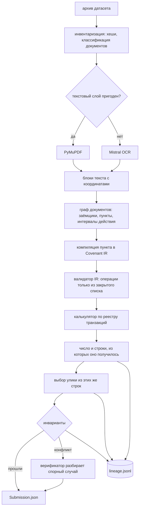

# halyk

Агент проверки ковенантов. На входе — архив с кредитными договорами,
допсоглашениями и реестром транзакций. На выходе — по каждому ковенанту каждого
заёмщика вердикт, число, которым он обоснован, и транзакция-улика.

Ключевое свойство: **арифметику и вердикт выдаёт код, а не языковая модель**. Модель
читает договор и компилирует пункт в типизированную спецификацию; дальше работает
детерминированный исполнитель, который по каждому ответу оставляет цепочку от
координат в PDF до конкретных строк реестра.

Состояние: собраны контракты данных, аудиторский след и инфраструктура прогона.
Стадии разбора документов и расчёта дописываются под формат опубликованного датасета.

## Быстрый старт

```bash
uv sync --all-groups --locked
cp .env.example .env          # ключи моделей

uv run halyk solve --input data/dataset.zip --output Submission.json
uv run halyk validate --submission Submission.json
```

Запасной путь, если не хочется чинить окружение:

```bash
docker build -t halyk-agent .
docker run --rm --env-file .env -v $PWD/data:/data halyk-agent \
    solve --input /data/dataset.zip --output /data/Submission.json
```

## Как это работает



Допсоглашения не заменяют договор целиком: версионирование идёт по пунктам, и
исполнитель получает ту редакцию пункта, которая действовала на дату измерения.

## Что остаётся после прогона

Каждый запуск пишет каталог `artifacts/runs/<run_id>/`:

| Файл | Что внутри |
|---|---|
| `run_manifest.json` | хеш входного архива, коммит, хеш lock-файла, версии моделей, режим запуска, хеш сабмита |
| `lineage.jsonl` | по записи на ковенант: источники с координатами, IR, шаги расчёта, строки, число, вердикт, улика, инварианты |
| `metrics.json` | документы, страницы, страницы через OCR, вызовы моделей, попадания в кэш, токены, стоимость, время |
| `model_cache/` | ответы моделей по хешу запроса |

`lineage.jsonl` — единственный источник правды: отчёт, команда `explain` и проверка
инвариантов читают его, а не пересчитывают заново.

## Разбор одного ответа

```bash
uv run halyk explain B-014 C-003
```

Печатает цепочку целиком: цитату из договора с указанием файла и страницы,
скомпилированный IR, шаги фильтрации с количеством строк, итоговое сравнение с
порогом и выбранную улику. Это же содержимое попадает в HTML-карточку решения
вместе с вырезкой страницы договора по координатам.

## Воспроизводимость

Решение должно перезапускаться и давать те же ответы. `temperature=0` этого не
гарантирует, поэтому воспроизводимость обеспечивается явно.

```
resume/retry внутри того же run_id   кэш читается по умолчанию
новый прогон                         живые вызовы, кэш только по --cache-read
повторение конкретного прогона       --replay artifacts/runs/<run_id>
```

Новый прогон никогда не читает чужой кэш молча: ключ кэша включает хеши исходных
документов, а режим пишется в манифест вместе со счётчиками `cache_hits` и
`live_calls`. Сколько прогон посчитал, а сколько воспроизвёл — видно в артефакте.

`make verify-determinism` проверяет это двумя способами: повтор из кэша обязан
совпасть байт-в-байт, а два живых прогона на открытом датасете сравниваются, и
измеренное расхождение публикуется здесь же.

Кэш боевого прогона в репозиторий не коммитится — это производные закрытого
датасета. Его хеш зафиксирован в манифесте, сам артефакт передаётся по запросу.
В репозитории лежит только `artifacts/example-run/` на открытых данных.

Подробности — [docs/adr/0006](docs/adr/0006-reproducibility-and-cache-policy.md).

## Структура

```
src/halyk/
├── models/         контракты данных, из них же генерируются JSON Schema
├── ingest/         распаковка архива, инвентаризация, классификация
├── parsing/        PyMuPDF, оценка пригодности текстового слоя, OCR
├── knowledge/      заёмщики, пункты, интервалы действия
├── compiler/       текст пункта → Covenant IR
├── execution/      калькуляторы, выбор улики
├── verification/   инварианты и разбор конфликтов
├── output/         сборка ответа, проверка по схеме, отчёт, explain
├── llm/            клиент моделей и кэш по содержимому
└── run/            каталог прогона, манифест, аудиторский след
```

Схемы в `schemas/` не пишутся руками — они выгружаются из моделей, а CI проверяет,
что закоммиченная версия совпадает с текущей.

## Решения по архитектуре

Развилки, которые дорого менять, вынесены в [docs/adr](docs/adr/): разделение ролей
модели и кода, деньги целым числом в тиынах, версионирование по пунктам, отказ от
агентных фреймворков, правило выбора улики, политика кэша.

## Разработка

```bash
make quality   # ruff, mypy, синхронность схем с моделями
make test      # pytest
make schemas   # перегенерировать схемы после правки моделей
```
